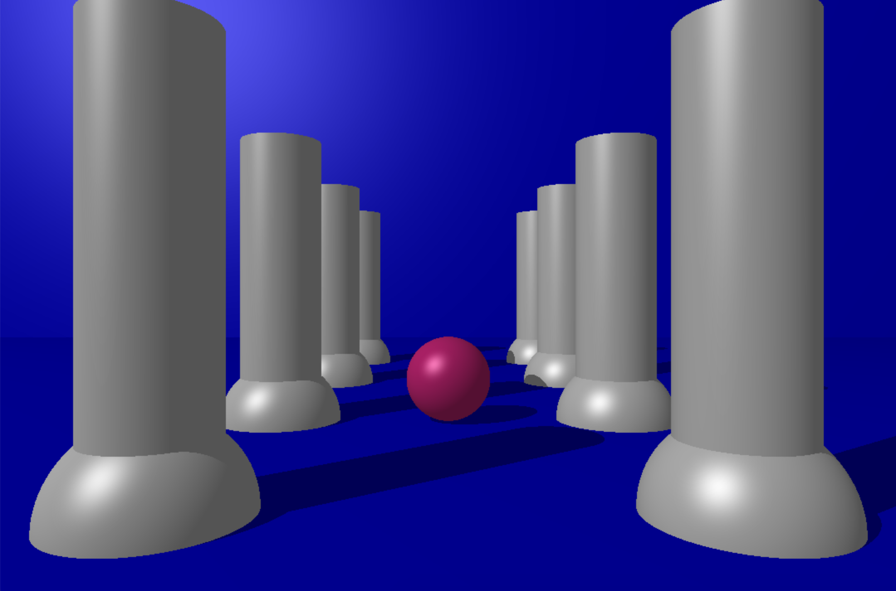

<h1 align="center">42cursus - MiniRT</h1>

<p align="center">
	
	
</p>

MiniRT is a project that serves as the introduction to the world of raytracing.

For more projects related to 42cursus, please visit the [hive-42cursus](https://github.com/wengcychan/hive-42cursus.git) repository.

## Introduction

This project involves creating computer-generated images, each representing a unique scene. The scenes are defined by simple geometric objects, each with its lighting system.



## Usage

To compile and run miniRT, follow these steps:

1. Clone the repository to your local machine:

   ```bash
   git clone https://github.com/wengcychan/42cursus-miniRT.git
	```

2. Compile the program:

   ```bash
	make
	```
&nbsp;&nbsp;&nbsp;&nbsp;&nbsp;&nbsp;&nbsp;&nbsp;&nbsp;&nbsp;&nbsp; This will generate an executable named `miniRT`.

3. Execute your miniRT program using a scene description file as a parameter:

   ```bash
	./miniRT scene.rt
	```
&nbsp;&nbsp;&nbsp;&nbsp;&nbsp;&nbsp;&nbsp;&nbsp;&nbsp;&nbsp;&nbsp; Replace `scene.rt` with the name of your scene description file.

## Showcase


<br> <br>

<br> <br>


## Contributors

- [Lei](https://github.com/srall123)
- [Wing](https://github.com/wengcychan)
